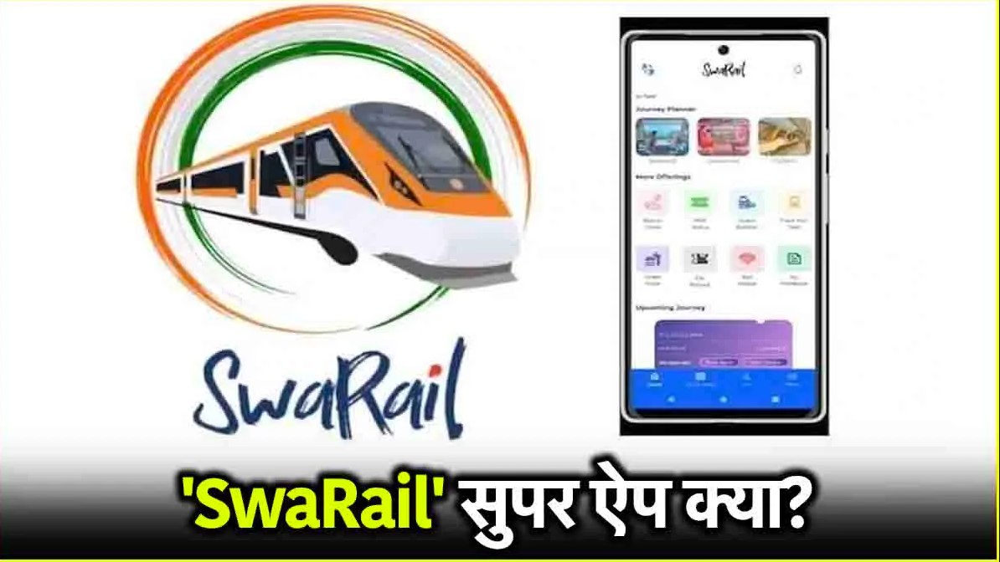

# 🌟 Swarail APP: Revolutionizing Mobile Gaming Experience!
>[Download Swarail APP](https://apkmodjoy.net/)
--------

## 🎮 What is Swarail APP

Swarail APP is a trending mobile application that blends interactive gameplay with smooth navigation, offering users an exciting way to engage with a digital rail-based environment. Designed for both casual players and serious gamers, the app provides a unique experience where users can explore stations, collect rewards, and complete thrilling tasks. It's not just a game—it’s a journey across virtual tracks, made for fun and challenge.

## 🎮 Graphics in it

Swarail APP features vibrant and high-quality 3D visuals that immerse players in a stylized rail-themed world. From detailed environments like urban rail stations to countryside landscapes, the game’s graphics truly stand out. The animations are smooth, colors are vivid, and overall, the visual design ensures a pleasing experience for users of all ages.

## 🎮 Features in it

Some standout features of Swarail APP include:

* 🛤️ Multiple missions and levels
* 🎁 Daily rewards and power-ups
* 🚂 Customizable train characters
* 📍 GPS-based station interactions
* 🌐 Online leaderboard and achievements
  Each feature is crafted to keep the user engaged and returning for more, offering both entertainment and progression.

## 🎮 Design and user experience

The interface of Swarail APP is sleek and intuitive, allowing players to navigate easily between missions and settings. The controls are responsive, and the menus are cleanly arranged, ensuring even first-time users can play without confusion. Whether on a high-end or budget device, the app is optimized for smooth performance.

## 🎮 Conclusion

Swarail APP is a well-rounded mobile game that excels in graphics, features, and user experience. Whether you're into challenges or just looking for casual fun, this app delivers it all—no ko có trích dẫn needed. Download now and ride the rails of excitement! 🚄✨